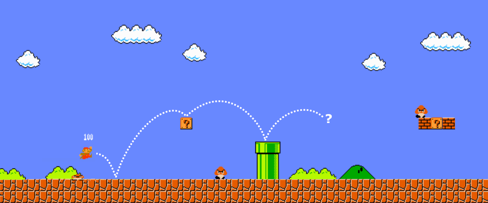

# Super Mario Bros

This project is based on an [OpenAI Gym](https://www.gymlibrary.dev) environment for [Super Mario Bros](https://pypi.org/project/gym-super-mario-bros/) and uses the [Stable-Baseline3](https://stable-baselines3.readthedocs.io/en/master/) library to train a Reinforcement Learning Agent *(PPO aka. Proximal Policy Optimization)* to play the game.

## How the code works

A new agent training can be initialized using a [GitHub Action](https://github.com/datennerd/super-mario-bros/blob/main/.github/workflows/train-agent.yml).
Here, a parameter is used to decide whether the training should take place locally (in a GitHub Action itself) or on the Google Cloud Platform.
This way, new ideas can be quickly tested locally whereas the final training then takes place in [Vertex AI](https://cloud.google.com/vertex-ai).
A custom job pulls a current Docker Image (is also created and uploaded via a [GitHub Action](https://github.com/datennerd/super-mario-bros/blob/main/.github/workflows/build-push-gar.yml)) with all code from the [Artifact Registry](https://cloud.google.com/artifact-registry) and creates a new [Cloud Storage](https://cloud.google.com/storage) bucket, where all model artifacts are then stored.
